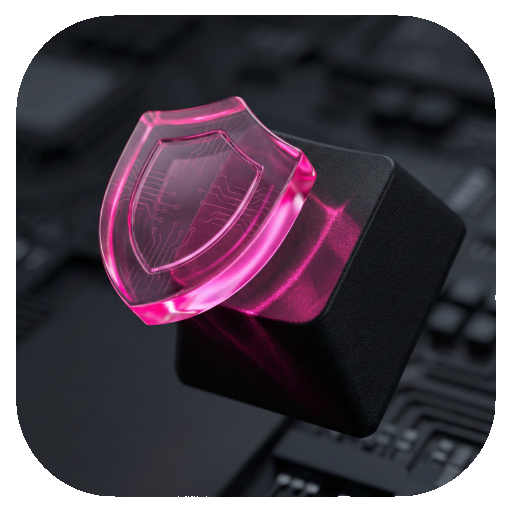
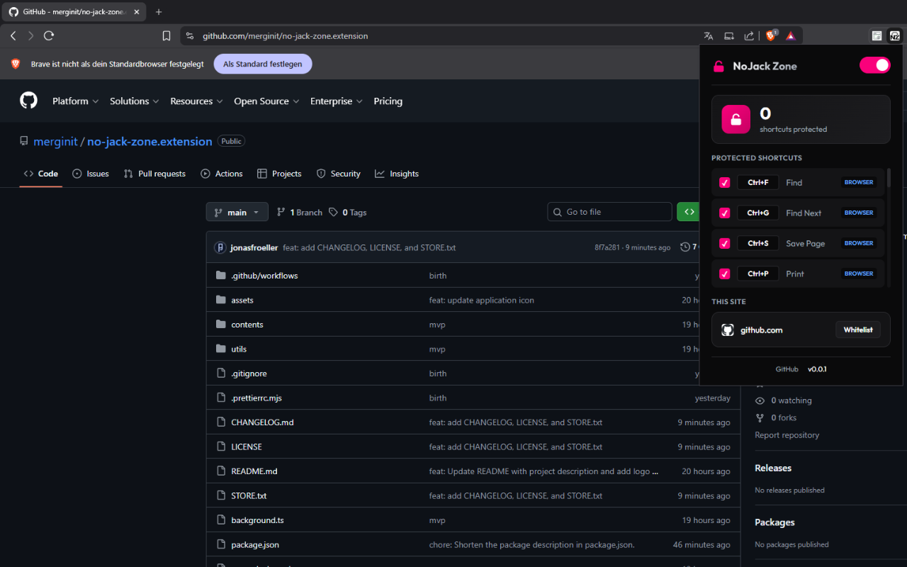

# NoJack Zone

<div align="center">
    
</div>

<div align="center" style="margin-bottom: 2.5rem;">
    <span style="font-size: 2.5rem;">
      <b><strong style="font-size: 5rem;">NoJack Zone</strong></b>
      <br>"NoJack Zone prevents websites from hijacking your browser's keyboard shortcuts. This anti-jackware extension protects essential shortcuts like Ctrl+F, Alt+Left, and Ctrl+C from being overridden by sites. When a site attempts to hijack your shortcuts, NoJack Zone automatically re-jacks control back to you, ensuring your browser functions exactly as intended."
    </span>
</div>

<br />

<div align="center">
  
</div>

<br />

## Development

Run the development server:

```bash
pnpm dev # `build/chrome-mv3-dev`
```

[Documentation](https://docs.plasmo.com)

## Production build

Run the following:

```bash
pnpm build
```

### Publishing

Use the built-in [bpp](https://bpp.browser.market) GitHub action. Prior to using this action however, make sure to build your extension and upload the first version to the store to establish the basic credentials. Then, simply follow [this setup instruction](https://docs.plasmo.com/framework/workflows/submit) and you should be on your way for automated submission!
